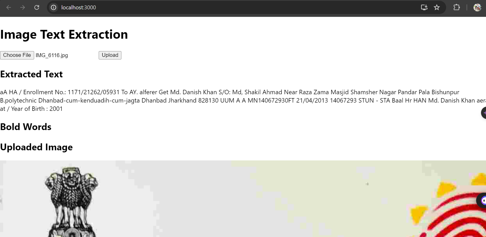

# Image Text Extraction Application

This is a full-stack application developed with Django and React that allows users to upload images, extract text content (including bold words) from the images using OCR, and display the results. 

## Features

- Image upload from the frontend.
- OCR text extraction on the backend.
- Identification and isolation of bold words.
- Storage of the extracted text, bold words, and image in base64 format in a database.
- Display of the uploaded image, extracted text, and bold words on the frontend.
- User authentication and access control.

## Technologies Used

- **Backend:** Django, Django REST Framework, Tesseract OCR
- **Frontend:** React, Axios
- **Database:** SQLite (default), can be configured for PostgreSQL or other databases
- **OCR:** Tesseract OCR

## Installation

### Prerequisites

- Python 3.x
- Node.js and npm
- Tesseract OCR

### Backend Setup

1. **Clone the repository:**

   ```sh
   git clone https://github.com/yourusername/image-text-extraction.git
   cd image-text-extraction



